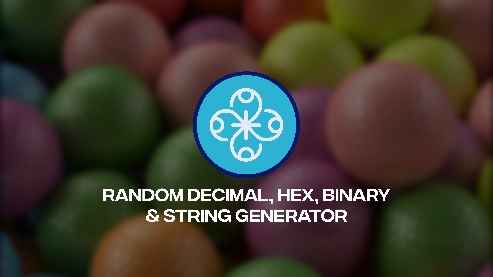

# [Random Decimal Hex Binary and String Generator](https://harsh98trivedi.github.io/Random-Decimal-Hex-Binary-Generator)

A beautifully simple, perfectly centered, and accessible **Random Decimal Hex Binary and String Generator** that produces unique, non-repeating outputs in multiple formats — decimal numbers, hexadecimal, binary, and alphanumeric strings. Every result is guaranteed unique per mode and length on each device. The app features smooth animations, OCD-satisfying CSS, full accessibility, and persistent history between sessions.

---

## ✨ Features

- **Supported Modes:**  
  - Decimal numbers (any digit length, up to 1000)  
  - Hexadecimal (A–F, 0–9, up to 1000 characters)  
  - Binary (0/1, up to 1000 characters)  
  - Alphanumeric strings (A–Z, a-z, 0-9, up to 1000 characters)  

- **Preset Lengths:**  
  Quick-select buttons for lengths 5, 10, 15, 20, 25 — all rounded to multiples of 5.

- **Perfectly Centered Modern Layout:**  
  Built with Tailwind CSS grid and flexbox for complete visual and vertical centering on any screen or device.

- **Output Box & Fixed Font:**  
  - Large, bold output text that never shrinks or scrolls—always clearly readable, even at maximum length.  
  - Output text wraps nicely without overflow or scrollbars.

- **Fixed Max Length:**  
  Max length is fixed at **1000**, enforced everywhere for consistent behavior.

- **Non-Repeating Unique Outputs:**  
  - Every generated output is checked against a persistent history stored in device `localStorage`.  
  - The same output will never be generated twice for the same mode and length unless storage is cleared.  
  - If all possible outputs are exhausted for a given mode and length, a clear "All numbers used!" message is displayed.

- **Preset & Length Controls:**  
  - Preset buttons enforce multiples of 5.  
  - Slider and numeric input are kept in sync and remember user settings via `localStorage`.

- **Accessible, Large Interaction Buttons:**  
  - **Roll:** Large button with dice icon, includes pop animation and a temporary full-screen "Rolled!" overlay.  
  - **Copy:** Large button with copy icon, triggers clipboard copy with an animated full-screen "Copied!" overlay.  
  - Buttons are keyboard accessible, focusable, and touch-friendly.

- **Keyboard & Touch Accessibility:**  
  Tab-navigable controls with visible focus outlines and proper ARIA roles.

- **Smooth GSAP-Powered Animations:**  
  - Output bounces and changes color on roll.  
  - Roll and Copy buttons animate when clicked.  
  - Full-screen overlays visually confirm actions.

- **Footer Credit:**  
  Displays “Made with ❤️ by Harsh Trivedi” with a FontAwesome heart icon, always centered at the bottom.

- **OCD-Perfect CSS:**  
  Dimensions, spacing, and typography use values rounded to multiples of 5 for uniformity and elegance.

---

## 🛠️ Tech Stack

- **HTML5 & CSS3** with Poppins font and FontAwesome icons  
- **Tailwind CSS** for layout and responsiveness via CDN  
- **Vanilla JavaScript (ES6+)** for logic, generation, and UI control  
- **GSAP (GreenSock)** for advanced animations and overlays  
- **localStorage & Cookies:**  
  - `localStorage` tracks generated outputs and remembers user settings  
  - Cookies store user preferences like last selected mode and auto-copy toggle

---

## 🔒 Accessibility & UX

- All controls have descriptive ARIA attributes and visible, pronounced focus states  
- High contrast black & white color scheme for readability  
- Responsive and adaptive on mobile, tablet, and desktop devices  
- Output and overlays announce changes via `aria-live` regions  
- No scrollbars or clipped content during normal operation  
- Clear, user-friendly messages when output space is exhausted

---

## ⚙️ Customizing

- **Preset Lengths:**  
  Edit the preset values inside the `setPresets()` function in `app.js`. Ensure they remain multiples of 5 for UI consistency.  
- **Max Length:**  
  By default fixed at 1000; increase by adjusting the max values in HTML and JS accordingly.  
- **Appearance & Fonts:**  
  Modify styling in `style.css`, especially `.unboxed-output` for font size and padding.  
- **Animations:**  
  Adjust or replace GSAP animations in the JS file for custom effects or disable GSAP if desired (app still fully functional).  
- **Auto-Copy Feature:**  
  Toggle on/off is user-controllable via checkbox; state saved in cookies.

---

## How Non-Repeating Output Works

- Generated outputs are recorded by mode and length in browser `localStorage`.  
- Prior to displaying, the app checks this history and regenerates until a unique output is found or maximum attempts reached.  
- If all outputs are exhausted, the app displays "All numbers used!".  
- Users can clear browser storage to reset history and start fresh.

---

## Why This Project?

- For users who want a dependable, multi-format random generator with guaranteed uniqueness per session and device.  
- To provide a clean, accessible, and visually balanced tool that’s equally great on phones, tablets, and desktops.  
- For those who desire elegant, OCD-approved spacing and sizing in design.  
- To offer frictionless offline use with no external dependencies beyond CDN scripts.

---

## License

MIT License — use and modify freely.  
Please credit if you share or reuse.

---

**Made with** ❤️ **by Harsh Trivedi**   
*For questions or customizations, open an issue or contact [Harsh Trivedi](https://harsh98trivedi.github.io/links) directly.*
